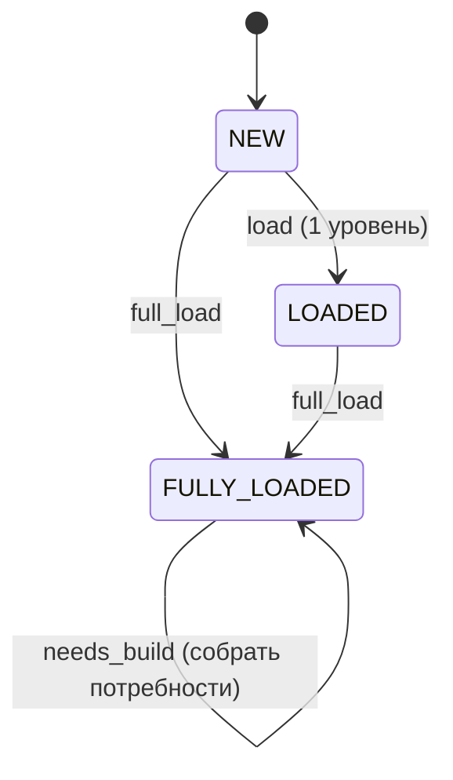

# Design: поиск нишевых продуктов по дереву запросов

Статус: дизайн (v5). Термины кода — на английском, пояснения — на русском. Алгоритмы — прозой;
из «кода» только SQL-схема и компактные JSON-контракты. Промпты LLM — в
`task-worker-mcp/prompts/`, в спеке НЕ дублируются.

## 0. Зачем

Дерево запросов Вордстата — это **фразы**. Продукт делают не под фразу, а под **работу**: то,
какой результат человек хочет получить. Одну работу выражают десятки формулировок — синонимы,
перестановки, опечатки, добавленные модификаторы. Цель инструмента: найти работы, где **есть
спрос, но нет продукта**, и внутри них — узкие потребности, которые закрываются небольшим
продуктом.

Принципы:

- Ценность = **спрос ÷ конкуренция × лёгкость реализации**. Частота — приоритет, не фильтр
  ценности.
- **Единица вывода — работа, а не фраза.** Отчёт по каждой формулировке был бы одним и тем же
  текстом, а спрос ниши, размазанный по формулировкам, выглядит мелким в каждой из них.
- Реальную конкуренцию знает **только выдача** — её не угадываем, а проверяем.
- **Никаких штатных ошибок и транзакций.** Каждое состояние согласовано (в нём система могла бы
  оказаться и при ручных действиях). Операция либо доводит дело до следующего состояния, либо
  падает → **ошибка в лог, данные остаются как были**. Ни отмены, ни пауз.
- **Ретрай — только там, где источник сам просит повторить.** XMLRiver отвечает
  `code=500 «Выполните перезапрос»` — это его собственная пометка «отказ транзиентный», и такой
  запрос повторяется (10 c, 30 c, 60 c). Всё остальное — ошибка в лог без повтора.
  **Отказ источника нельзя ни кэшировать, ни принимать за пустой результат** — иначе он застывает
  в данных как факт «уточнений нет». (Прецедент: 97 таких ответов осели в кэше, 12% записей, и 97
  узлов навсегда стали листьями.)
- **Ничего не выдумываем.** Фразы, которой нет в дереве, система не показывает узлом: иначе на
  опечатке появляется узел с кнопками, ведущими в платный запрос.

## 1. Два слоя: факты и толкование

Главное структурное решение.

| | Первый слой | Второй слой |
|---|---|---|
| Что | **дерево запросов**: фразы, частоты, выдача | **дерево потребностей**: работы и выводы по ним |
| Природа | **факты**. Оплачены, не спорны | **толкование**. Гипотеза |
| Жизненный цикл | только прирастает | одноразовое: снести и собрать заново |
| Где живёт | БД (`node`/`edge`, `cache`, `serp`) | файлы (`logs/needs-lab/<id>/`) |
| Кто меняет | краул | сборка LLM по ветке |

Второй слой **только ссылается** на первый и никогда его не переписывает. Это продолжение
правила, которое уже работает внутри первого слоя: `cache` оплачен и неприкосновенен, а
`node`/`edge` — производная, пересобираемая из него.

Следствие, ради которого всё и сделано: **порог, правило группировки или неудачная сборка ничего
не портят** — толкование пересобирается, факты остаются.

## 2. Первый слой: дерево запросов

Отвечает на «какие фразы люди печатают и как они уточняют друг друга». Больше ни на что.

### Статусы

| Статус | Смысл |
|---|---|
| `NEW` | не загружен (фронтир). Дефолт |
| `LOADED` | загружен ЧАСТИЧНО — собственный пул, 1 уровень (браузинг) |
| `FULLY_LOADED` | загружен ПОЛНОСТЬЮ — узел и все сабузлы (≥ `FLOOR`). ГЕЙТ для сборки потребностей |

Статус — это **состояние загрузки**, ничего больше. Выводы (интент, конкуренция, вердикт) к узлу
не приписываются: они относятся к работе, а работа живёт во втором слое.



### Переходы

| From | Операция | To |
|---|---|---|
| `NEW` | `load` (1 уровень) | `LOADED` |
| `NEW` / `LOADED` | `full_load` | `FULLY_LOADED` |
| `FULLY_LOADED` | `needs_build` | статус НЕ меняется (результат — во втором слое) |

`needs_build` — единственная операция, которая ничего не пишет в модель первого слоя. Это и
означает «толкование не портит факты».

### Кнопки по статусу

Показываются ТОЛЬКО разрешённые. Во время операции кнопки затронутого узла **и всего его
поддерева** заблокированы (не Cancel — просто disabled). Отмены и ретрая нет.

| Статус | Кнопки |
|---|---|
| `NEW` | `Load` (1 ур.) · `Full load` |
| `LOADED` | `Full load` |
| `FULLY_LOADED` | **`Собрать потребности`** |

### `full_load` (краул)

- **`LOADED`** — собственный пул на 1 уровень. **`FULLY_LOADED`** — весь subtree (каждый потомок
  ≥ `FLOOR` запрошен). Только `FULLY_LOADED` открывает сборку потребностей.
- **Как работает:** многократно опрашиваем фронтир, best-first по частоте, пока фронтир не
  опустеет.
- **`FLOOR = 50`** — граница РЕКУРСИИ: ниже не бурим вглубь (хвост почти нулевой), но узел и ребро
  пишем, и он остаётся валидным листом. НЕ фильтр ценности.
- **DAG-дедуп:** ребёнок — строгое словесное супермножество родителя (циклов нет). Фраза с
  нескольких родителей фетчится один раз, ребро — от каждого.
- **Потолка (CAP) нет.** Объём заранее показываем оценкой в диалоге подтверждения
  («~N узлов / ~X запросов — Да/Нет»).
- Прогресс и статусы — по websocket, в реальном времени.

**`LIMIT` и `WORKERS`.** `LIMIT = 2000` — сколько фраз из пула оставляем детьми; это потолок
самого источника (XMLRiver отдаёт не более ~2000 «популярных»), а не тюнинг. `WORKERS ≈ 6` —
сколько запросов держим параллельно во время краула: фетч упирается в сеть, поэтому 6
одновременных ускоряют краул в ~6× при вежливой нагрузке.

### Инвариант `FULLY_LOADED`

Узел держит этот статус, только пока **всё его поддерево загружено** (каждый потомок с
`freq ≥ FLOOR` запрошен). Узлы могут стать незагруженными *позже* — например когда выбрасывается
испорченная запись кэша; тогда предки продолжают утверждать «загружено полностью», хотя это уже
ложь, и `full_load` по ним не запустить (операция разрешена только из `NEW`/`LOADED`). Поэтому
нарушители инварианта возвращаются в `LOADED`. Потомки ниже `FLOOR` нарушением не считаются —
вглубь них мы и не бурим.

## 3. Второй слой: дерево потребностей

Отвечает на «какие работы люди хотят сделать и где из них не закрыта потребность».

### Три уровня

1. **Условие** — рамка ветки, если она есть. Слова «бесплатно», «без регистрации», «на русском»,
   «онлайн» — **не работа**, а требование к продукту и признак аудитории. Если вся ветка стоит
   под таким условием, он называется один раз сверху и работы по нему не дробятся.
2. **Работа** — какой результат человек хочет получить. Её выражают десятки формулировок.
3. **Сегмент** — более узкая работа внутри работы: другой вход, другая аудитория, другое
   ограничение. Здесь обычно и живёт микро-продукт.

Пример: ветка `нейросеть бесплатно без регистрации` (86 201) — это **условие**, а не ниша; внутри
неё десяток работ («оживить фото», «создать песню», «написать текст»), а внутри работы «написать
текст» — сегмент «фанфики» (589), у которого своя аудитория. Разобранный пример — `needs-tree.md`.

### Что работой не является

Такие фразы в дерево потребностей **не входят** — и никакой пометки в первом слое для этого не
нужно:

| Причина | Что это |
|---|---|
| `brand` | ищут вход в конкретный известный продукт (имя собственное) |
| `catalog` | «покажи список», «лучшие», «сайт» — человек хочет каталог |
| `consumption` | хотят потребить готовое, а не сделать своё («слушать», «скачать песни») |
| `broken` | фраза сломана: опечатка, обрывок, набор слов |
| `condition` | фраза выражает только условие и работы не называет |

### Неясные фразы не выбрасываются

Бывает, что объект понятен, а результат нет («нейросеть фото бесплатно без регистрации» — что
сделать с фото?). Такие фразы собираются в **отдельную работу с пометкой «не ясно»**, а не
исключаются: это реальный спрос, который не удалось отнести, и выброс его прячет. На разобранной
ветке таких оказалось две группы на 7 467 и 7 066 — третья и четвёртая по величине.

### Спрос работы не суммируется

Частота Вордстата — широкое соответствие: число более общей фразы **уже включает** свои
уточнения. Поэтому у работы указывается **`top_freq`** (наибольшая частота среди её формулировок)
и **число формулировок**, а не сумма. Проверено на данных: частота родителя ≥ максимума детей в
250 случаях из 250, при этом сумма детей превышает родителя в 70% случаев — наивное суммирование
завысило бы спрос кратно.

### Что сборка отмечает сама

- **`occupied_by`** — работа похоже занята: рядом в ветке лежат брендовые запросы продукта,
  который её делает.
- **щель** — узкая работа или сегмент со своей аудиторией, которую крупные продукты обслуживают
  плохо или намеренно не обслуживают.
- **нужна выдача** плюс вопрос к ней — по каким работам «занято или нет» из слов не решается.
  Это **список покупок**: выдача платная, и покупается только по этим отметкам.

Всё перечисленное — **гипотезы сборки**, а не факты. Разбор работы (§4) имеет право их
опровергнуть выдачей, и это ценнее подтверждения.

## 4. Операции

Четыре, все асинхронные, каждая — одна строка `task`.

### 4.1 `load` (XMLRiver, без LLM)

Пул фразы на один уровень вниз. `NEW → LOADED`.

### 4.2 `full_load` (XMLRiver, без LLM)

Краул поддерева до опустевшего фронтира (§2). `NEW`/`LOADED` → `FULLY_LOADED`.

### 4.3 `needs_build` (LLM, одна ветка = один джоб)

Сборка дерева потребностей по ветке. Промпт: `prompts/needs.md`.

- **вход:** ветка целиком — фразы с частотами и структурой «кто кого уточняет», диапазон
  `FLOOR … 30000` (голова выше 30 000 не берётся: интент там размыт по определению).
- **единица — ВЕТКА, а не узел.** Смысл сборки в сравнении внутри ветки: узкая работа на 589 —
  шум сама по себе и заметная щель рядом с работой на 3 861. По одному узлу этого не видно.
- **выход:** дерево потребностей файлом во втором слое.
- **правило полноты:** каждая входная фраза встречается в ответе **ровно один раз** — в работе,
  её сегменте или в исключённых. Сборка, потерявшая или выдумавшая фразы, не принимается.
- статус узла не меняется.

### 4.4 `needs_analyze` (XMLRiver + LLM, одна работа)

Разбор работы: **сначала выдача, потом Opus**, одной командой. Промпт: `prompts/analyze_work.md`.

- **выдача** покупается по самым частотным формулировкам работы (они её и представляют) и ложится
  в общий оплаченный кэш `serp`; остальные формулировки уходят в промпт списком с частотами — это
  ядро ключей ниши.
- **Opus** получает работу целиком: все формулировки с частотами, сегменты, условие ветки,
  гипотезы сборки и выдачу. Отвечает: `BUILD` / `MAYBE` / `SKIP`, `verdict_score` 0–100,
  уверенность и **полный HTML-отчёт**.
- **выход:** отчёт файлом (`reports/{id}.html`) плюс запись разбора рядом с деревом. В первый слой
  не пишется ничего.
- в отчёте обязательны: все формулировки работы с частотами (ядро ключей) и отдельный блок по
  узкому сегменту, если он найден — даже когда по всей работе вердикт `SKIP`.

## 5. Модель данных

### `semcore.db`

| Таблица | Что | Правило |
|---|---|---|
| `cache` | ответы Вордстата | **оплачено. Не пересоздавать и не чистить никогда** |
| `keywords` | legacy-ветка | не трогать |
| `node` / `edge` | дерево запросов | **производная**: пересобирается из `cache` |
| `serp` | выдача, ключ «фраза + движок» | **оплачено**: повторный запрос бесплатен |
| `task` | журнал операций | вкладка Task |
| `report` | legacy: отчёты по узлам | не используется — отчёт принадлежит работе |

**`node` — живые колонки:** `phrase` (PK), `freq`, `queried`, `total_refinements`, `queried_at`,
`status`, `task_id` (пока не `NULL` — узел заблокирован), `error`, `error_stage`, `note` (**ручная**
пометка пользователя, система её не трогает).

Схема несёт ещё колонки от узлового пайплайна (`kind`, `score`, `verdict`, `verdict_score`,
`competition_*`, `description`, `signals_json`, таймстемпы шагов, `meant`). Они пусты и оставлены
намеренно: **схема развивается только аддитивно** — после первого прогона колонки не удаляются и
не переименовываются, иначе пересборка `node` из `cache` затрёт оплаченные результаты.

### `serp` — кэш выдачи

```sql
CREATE TABLE IF NOT EXISTS serp (
  phrase TEXT NOT NULL, engine TEXT NOT NULL,      -- 'yandex' | 'google'
  found INTEGER,                                   -- всего найдено (задел, в оценке не участвует)
  docs_json TEXT NOT NULL,                         -- [{rank,url,title,snippet}]
  fetched_at INTEGER NOT NULL, PRIMARY KEY (phrase, engine));
```

Инвариант: пишем **обе** выдачи или ни одной — падение движка не оставляет частичной.

### `task` — журнал операций

```sql
CREATE TABLE IF NOT EXISTS task (
  id TEXT PRIMARY KEY, type TEXT NOT NULL,         -- load|full_load|needs_build|needs_analyze
  status TEXT NOT NULL,                             -- QUEUED|WAITING|RUNNING|DONE|FAILED
  node TEXT, params TEXT, result TEXT,
  created_at INTEGER, started_at INTEGER, finished_at INTEGER, error TEXT);
```

`node` — фраза для операций первого слоя, **имя работы** для `needs_analyze`: так строка журнала
читается человеком.

**Статусы задачи и что они значат.** `QUEUED` — принята, ждёт своей очереди на сервере (доли
секунды). `WAITING` — джоб отдан в очередь LLM, но **исполнитель его ещё не взял**: сервер свою
часть сделал, работы никто не делает. `RUNNING` — **работа реально идёт**: либо система работает
сама (краул, покупка выдачи), либо агент забрал данные джоба.

Различение обязательное, а не косметика: без него «висит, потому что петля не запущена»
неотличимо от честной работы, и задача молча идёт к таймауту под видом `RUNNING`. Достоверная
отметка «началось» — момент, когда исполнитель **забрал данные** джоба: сигнал мог получить
диспетчер и не раздать.

### Второй слой — файлами

```
logs/needs-lab/<id>/params.json           вход сборки: фразы ветки с частотами
logs/needs-lab/<id>/accepted.json         дерево потребностей
logs/needs-lab/<id>/analysis/<работа>.json  разбор работы: вердикт + ссылка на отчёт
reports/<id>.html                          сам отчёт (отдаётся статикой)
```

Почему не в БД: слой одноразовый, его пересобирают. В БД он тянул бы за собой миграции и рисковал
бы оплаченными данными. Выдача при разборе, наоборот, идёт в `serp` — за неё заплачено, и
переплачивать при пересборке слоя незачем.

## 6. Исполнение операций

Все операции — **асинхронные фоновые задачи**: не блокируют UI, трекинг — таблица `task`.
Два класса по тому, кто делает работу:

- **не-LLM** (`load`, `full_load`, и покупка выдачи внутри `needs_analyze`) — система выполняет
  сама (обращения к XMLRiver);
- **LLM** (`needs_build`, `needs_analyze`) — система **сама модель не зовёт**, а делегирует работу
  внешнему **LLM-агенту** и ждёт результат.

**Решение уровня дизайна — какая «голова» делает какую работу.** Сборка потребностей — задача на
суждение по большому контексту (вся ветка сразу), разбор ниши — тем более: обе идут на **Opus с
высоким уровнем усилий**. *Как* агент подключён и как задачи до него доходят — вопрос реализации
(`tech-design.md`).

## 7. API-поверхность (CQRS)

**Read model — WebSocket** (единый канал `/ws`): клиент подписывается, сервер шлёт снимок и
апдейты дерева, логи, апдейты задач. Всё чтение дерева, логов и задач — только отсюда.

**Второй слой читается по HTTP**, а не по WS: он живёт файлами и обновляется не потоком событий, а
завершением операции. Прецедент в проекте — `GET /api/estimate`.

**Write model — HTTP POST:**

- `POST /api/node/load` `{phrase}` — браузинг 1 уровень.
- `POST /api/node/full-load` `{phrase}` — краул поддерева.
- `POST /api/needs/build` `{phrase}` — собрать дерево потребностей по ветке.
- `POST /api/needs/analyze` `{tree_id, work}` — разбор работы (выдача + Opus).

Команда запускает фоновую задачу и сразу возвращает ack; прогресс и результат прилетают по
websocket (первый слой) либо появляются в файлах слоя и читаются ручкой (второй).

## 8. Требования к UI

*(Единое место для всех UI-требований.)*

**Пять вкладок:**

1. **Главная** — дерево запросов.
2. **Дерево потребностей** — таблица собранных деревьев; клик открывает дерево.
3. **Лог** — окно логов (§9).
4. **Task** — таблица задач: тип, узел, статус, время, ошибка.
5. **Отчёты** — разборы работ: работа, ветка, частота, число формулировок, вердикт,
   `verdict_score`, уверенность, ссылка. Сортировка по `verdict_score`.

**Главная:**

- Дерево с раскрытием. **`+` ничего не догружает** (CQRS): бирюзовый — локальные из пула родителя
  (приблизительно, бесплатно), синий `⚡` — реальные уточнения. Догрузка — только команды.
- Пагинация вширь: 120 детей, дальше «показать ещё».
- Поле корня — переключить ветку или нырнуть в узел. Живёт **только на этой вкладке**: на других
  оно ни при чём. Фразы, которой нет в дереве, узлом не показываем — вместо этого сообщение.
- **`Full load`** — перед запуском диалог подтверждения «Загрузит не менее ~N узлов / ~X запросов,
  может оказаться больше» (Да/Нет). Оценка считается по уже загруженному поддереву, поэтому для
  незагруженного узла близка к нулю: это **предупреждение об объёме, а не обещание числа**.
- **Блокировка на время операции:** пока по узлу идёт задача, заблокированы кнопки только
  затронутого узла и его поддерева. Отмены нет; ошибка уходит в лог, узел остаётся как был.
- Статусы и прогресс — по websocket, без перезагрузки и поллинга.

**Дерево потребностей:**

- Таблица: **узел ветки** (по нему и собрано) с id сборки мелким, частота, работ, сегментов, фраз,
  исключено, щелей, занято, разобрано, когда собрано. Строка кликабельна целиком.
- Открытое дерево: сверху **по какому узлу собрано** и отдельно **условие ветки** с пометкой
  «не ниша» — узел это факт, условие это вывод сборки, и путать их нельзя.
- Работы по убыванию частоты. На строке работы: частота, число формулировок, метки `ЩЕЛЬ` /
  `НЕ ЯСНО` / `занято: …` / `?выдача`, вердикт после разбора, кнопка **`Analyze`** (после разбора
  `Re-analyze`) и `Link` на отчёт.
- Раскрытие работы: обоснование сборки, вопрос к выдаче, формулировки **с частотами**, сегменты со
  своим обоснованием.
- Исключённые фразы — отдельным раскрытием, сгруппированы по причине с расшифровкой.
- Кнопка **Назад** возвращает к таблице.

## 9. Требования к логам

- **Отдельная вкладка «Лог».**
- **Что логируется:** ход операций, переходы статусов и **все ошибки** (упавший шаг → строка;
  данные при этом не меняются). Никаких «немых» падений.
- **Real-time** по websocket, без поллинга.
- **Дублирование в файл** — чтобы разработчик (или LLM) **смотрел логи сам**, а не просил их
  скинуть. Пишется всегда, даже если ни одна вкладка не открыта.
- **Кнопка «Удалить всё»** чистит и представление, и файл.
- **Формат строки одинаков** в UI и файле: `время · уровень · стадия · узел · сообщение`.
- При открытии вкладки показываем хвост файла, дальше — живой стрим.

## 10. Инварианты

1. **`cache` и `keywords` неприкосновенны.** `node`/`edge` — производная от `cache`.
2. **Схема развивается аддитивно.** Колонки не удаляются и не переименовываются.
3. **`FULLY_LOADED`** держится, только пока всё поддерево загружено (§2).
4. **Чтение не мутирует.** `root`/`expand` — проекция уже загруженного; ни фетчей, ни записей.
5. **Фразы вне дерева не существует.** Неизвестная фраза не показывается узлом.
6. **Выдача — либо оба движка, либо ни одного.** Частичной выдачи не бывает.
7. **Отказ источника не кэшируется** и не считается пустым результатом.
8. **Упало → состояние не изменилось.** Ошибка в лог, ретраев нет (кроме транзиентного отказа
   XMLRiver: 10/30/60 c).
9. **Второй слой не пишет в первый.** Сборка и разбор не меняют ни статусов, ни данных узлов.
10. **Сборка ничего не теряет:** каждая входная фраза встречается в дереве потребностей ровно
    один раз (в работе, сегменте или исключённых).
11. **Спрос работы не суммируется** — `top_freq` плюс число формулировок.
12. **Отчёт принадлежит работе**, не фразе.
