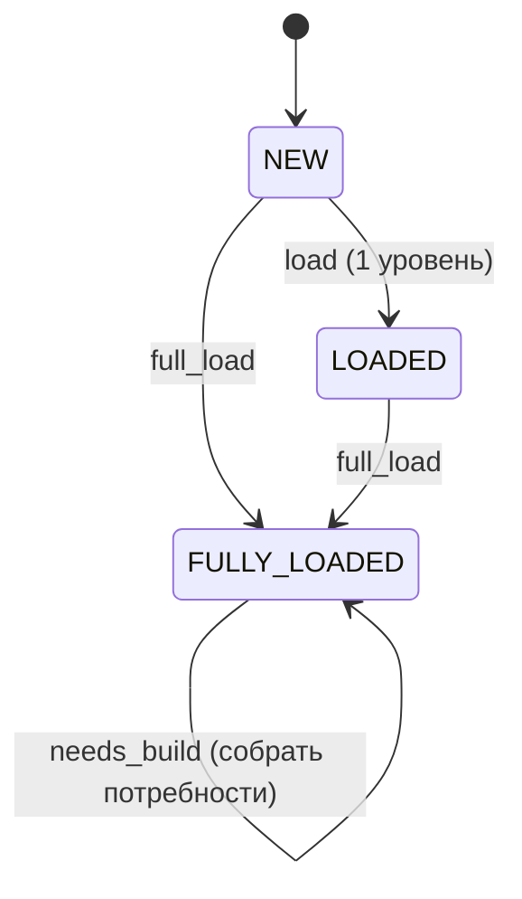

# Design: поиск нишевых продуктов по дереву запросов

Статус: дизайн (v5). Термины кода — на английском, пояснения — на русском. Алгоритмы — прозой;
из «кода» только SQL-схема и компактные JSON-контракты. Промпты LLM — в
`task-worker-mcp/prompts/`, в спеке НЕ дублируются.

## 0. Зачем

Дерево запросов Вордстата — это **фразы**. Продукт делают не под фразу, а под **работу**: то,
какой результат человек хочет получить. Одну работу выражают десятки формулировок — синонимы,
перестановки, опечатки, добавленные модификаторы. Цель инструмента: найти работы, где **есть
спрос, но нет продукта**, и внутри них — узкие потребности, которые закрываются небольшим
продуктом.

Принципы:

- Ценность = **спрос ÷ конкуренция × лёгкость реализации**. Частота — приоритет, не фильтр
  ценности.
- **Единица вывода — работа, а не фраза.** Отчёт по каждой формулировке был бы одним и тем же
  текстом, а спрос ниши, размазанный по формулировкам, выглядит мелким в каждой из них.
- Реальную конкуренцию знает **только выдача** — её не угадываем, а проверяем.
- **Никаких штатных ошибок и транзакций.** Каждое состояние согласовано (в нём система могла бы
  оказаться и при ручных действиях). Операция либо доводит дело до следующего состояния, либо
  падает → **ошибка в лог, данные остаются как были**. Ни отмены, ни пауз.
- **Ретрай — только там, где источник сам просит повторить.** XMLRiver отвечает
  `code=500 «Выполните перезапрос»` — это его собственная пометка «отказ транзиентный», и такой
  запрос повторяется (10 c, 30 c, 60 c). Всё остальное — ошибка в лог без повтора.
  **Отказ источника нельзя ни кэшировать, ни принимать за пустой результат** — иначе он застывает
  в данных как факт «уточнений нет». (Прецедент: 97 таких ответов осели в кэше, 12% записей, и 97
  узлов навсегда стали листьями.)
- **Ничего не выдумываем.** Фразы, которой нет в дереве, система не показывает узлом: иначе на
  опечатке появляется узел с кнопками, ведущими в платный запрос.

## 1. Два слоя: факты и толкование

Главное структурное решение.

| | Первый слой | Второй слой |
|---|---|---|
| Что | **дерево запросов**: фразы, частоты, выдача | **дерево потребностей**: работы и выводы по ним |
| Природа | **факты**. Оплачены, не спорны | **толкование**. Гипотеза |
| Жизненный цикл | только прирастает | одноразовое: снести и собрать заново |
| Где живёт | БД (`node`/`edge`, `cache`, `serp`) | файлы (`logs/needs-lab/<id>/`) |
| Кто меняет | краул | сборка LLM по ветке |

Второй слой **только ссылается** на первый и никогда его не переписывает. Это продолжение
правила, которое уже работает внутри первого слоя: `cache` оплачен и неприкосновенен, а
`node`/`edge` — производная, пересобираемая из него.

Следствие, ради которого всё и сделано: **порог, правило группировки или неудачная сборка ничего
не портят** — толкование пересобирается, факты остаются.

## 2. Первый слой: дерево запросов

Отвечает на «какие фразы люди печатают и как они уточняют друг друга». Больше ни на что.

### Статусы

| Статус | Смысл |
|---|---|
| `NEW` | не загружен (фронтир). Дефолт |
| `LOADED` | загружен ЧАСТИЧНО — собственный пул, 1 уровень (браузинг) |
| `FULLY_LOADED` | загружен ПОЛНОСТЬЮ — узел и все сабузлы (≥ `FLOOR`). ГЕЙТ для сборки потребностей |

Статус — это **состояние загрузки**, ничего больше. Выводы (интент, конкуренция, вердикт) к узлу
не приписываются: они относятся к работе, а работа живёт во втором слое.



### Переходы

| From | Операция | To |
|---|---|---|
| `NEW` | `load` (1 уровень) | `LOADED` |
| `NEW` / `LOADED` | `full_load` | `FULLY_LOADED` |
| `FULLY_LOADED` | `needs_build` | статус НЕ меняется (результат — во втором слое) |

`needs_build` — единственная операция, которая ничего не пишет в модель первого слоя. Это и
означает «толкование не портит факты».

### Кнопки по статусу

Показываются ТОЛЬКО разрешённые. Во время операции кнопки затронутого узла **и всего его
поддерева** заблокированы (не Cancel — просто disabled). Отмены и ретрая нет.

| Статус | Кнопки |
|---|---|
| `NEW` | `Load` (1 ур.) · `Full load` |
| `LOADED` | `Full load` |
| `FULLY_LOADED` | **`Собрать потребности`** |

### `full_load` (краул)

- **`LOADED`** — собственный пул на 1 уровень. **`FULLY_LOADED`** — загружено всё **валидное**:
  каждый потомок ≥ `FLOOR` запрошен, а что валидным не считается — не в счёт. Границ валидности
  две: `FLOOR` (ниже вглубь не бурим) и стоп-слова (туда не ходим вовсе). Только `FULLY_LOADED`
  открывает сборку потребностей.
- **Как работает:** многократно опрашиваем фронтир, best-first по частоте, пока фронтир не
  опустеет, и **после этого перепроверяем фронтир заново**: частота узла могла подрасти при
  повторном фетче и вывести его выше `FLOOR`, а решение «вглубь не идём» принималось по старому
  числу. Без перепроверки узлы молча выпадают из ветки.
- **`FLOOR = 50`** — граница РЕКУРСИИ: ниже не бурим вглубь (хвост почти нулевой), но узел и ребро
  пишем, и он остаётся валидным листом. НЕ фильтр ценности.
- **DAG-дедуп:** ребёнок — строгое словесное супермножество родителя (циклов нет). Фраза с
  нескольких родителей фетчится один раз, ребро — от каждого.
- **Потолка (CAP) нет.** Объём заранее показываем оценкой в диалоге подтверждения
  («~N узлов / ~X запросов — Да/Нет»).
- Прогресс и статусы — по websocket, в реальном времени.

**`LIMIT` и `WORKERS`.** `LIMIT = 2000` — сколько фраз из пула оставляем детьми; это потолок
самого источника (XMLRiver отдаёт не более ~2000 «популярных»), а не тюнинг. `WORKERS ≈ 6` —
сколько запросов держим параллельно во время краула: фетч упирается в сеть, поэтому 6
одновременных ускоряют краул в ~6× при вежливой нагрузке.

### Инвариант `FULLY_LOADED`

Узел держит этот статус, только пока **всё его поддерево загружено** (каждый потомок с
`freq ≥ FLOOR` запрошен). Узлы могут стать незагруженными *позже* — например когда выбрасывается
испорченная запись кэша; тогда предки продолжают утверждать «загружено полностью», хотя это уже
ложь, и `full_load` по ним не запустить (операция разрешена только из `NEW`/`LOADED`). Поэтому
нарушители инварианта возвращаются в `LOADED`. Потомки ниже `FLOOR` нарушением не считаются —
вглубь них мы и не бурим.

## 3. Второй слой: дерево потребностей

Отвечает на «какие работы люди хотят сделать и где из них не закрыта потребность».

### Три уровня

1. **Условие** — рамка ветки, если она есть. Слова «бесплатно», «без регистрации», «на русском»,
   «онлайн» — **не работа**, а требование к продукту и признак аудитории. Если вся ветка стоит
   под таким условием, он называется один раз сверху и работы по нему не дробятся.
2. **Работа** — что человек хочет сделать. Границу работы проводит **продукт**, а не вопрос:
   одна работа — это `пользователь + вход → микро-MVP`. Если один и тот же MVP из одного и того
   же входа закрывает обе группы фраз, это одна работа, сколько бы разных вопросов люди в ней ни
   задавали.
3. **Подгруппа внутри работы**, двух видов:
   - **сегмент** — другой вход, другая аудитория, другое ограничение. Здесь обычно и живёт
     микро-продукт;
   - **раздел** — тот же вход и тот же продукт, отличается только то, какую часть ответа человек
     спрашивает: позиция карты, глава отчёта, поле справки. Раздел не требует второй разработки.

Пример: ветка `нейросеть бесплатно без регистрации` (86 201) — это **условие**, а не ниша; внутри
неё десяток работ («оживить фото», «создать песню», «написать текст»), а внутри работы «написать
текст» — сегмент «фанфики» (589), у которого своя аудитория. Разобранный пример — `needs-tree.md`.

**Обратная ошибка — дробление одного продукта на разделы, и она дороже.** Когда один вход даёт
один многораздельный ответ, соблазн завести работу на каждый раздел велик: у каждого свой вопрос
и своя частота. Проверка одна: изменился ли вход и нужен ли второй движок? На ветке
`матрица судьбы` восемь позиций карты («центр», «под сердцем», «визитка», «зона комфорта»,
«деньги», «дети», «предназначение», «род») были заведены отдельными работами при одном входе —
дате рождения — и одном расчёте арканов. Разбор потом насчитал каждой свой бюджет разработки
против её доли пула, и все они вышли `SKIP`.

### Что работой не является

Такие фразы в дерево потребностей **не входят** — и никакой пометки в первом слое для этого не
нужно:

| Причина | Что это |
|---|---|
| `brand` | ищут вход в конкретный известный продукт (имя собственное) |
| `catalog` | «покажи список», «лучшие», «сайт» — человек хочет каталог |
| `consumption` | хотят потребить готовое, а не сделать своё («слушать», «скачать песни») |
| `broken` | фраза сломана: опечатка, обрывок, набор слов |
| `condition` | фраза выражает только условие и работы не называет |

### Неясные фразы не выбрасываются

Бывает, что объект понятен, а результат нет («нейросеть фото бесплатно без регистрации» — что
сделать с фото?). Такие фразы собираются в **отдельную работу с пометкой «не ясно»**, а не
исключаются: это реальный спрос, который не удалось отнести, и выброс его прячет. На разобранной
ветке таких оказалось две группы на 7 467 и 7 066 — третья и четвёртая по величине.

### Спрос работы не суммируется

Частота Вордстата — широкое соответствие: число более общей фразы **уже включает** свои
уточнения. Поэтому у работы указывается **`top_freq`** (наибольшая частота среди её формулировок)
и **число формулировок**, а не сумма. Проверено на данных: частота родителя ≥ максимума детей в
250 случаях из 250, при этом сумма детей превышает родителя в 70% случаев — наивное суммирование
завысило бы спрос кратно.

### Голова ветки не классифицируется, но и не теряется

Фразы выше `HEAD_FREQ` (30 000) в классификацию не идут: интент там размыт по определению. Но
выбрасывать их нельзя — это **контейнеры пула**, и рынок работы равен контейнеру, а не сумме его
детей. Они уходят во вход отдельным списком `head_nodes`, а разбор работы получает `head` — какие
контейнеры её накрывают и сколько её фраз под каждым.

Цена ошибки измерена: на ветке `матрица судьбы` разбор собрал пул руками из детей контейнера
«матрица судьбы рассчитать» и получил 71 717 против настоящих 204 741, после чего объявил рынок
недостаточным.

### Сборка ничего не знает о продукте

Сборка и второй проход отвечают только на вопрос **«какие фразы описывают одну работу?»**. В
`accepted.json` нет `score`, занятости, щелей, гипотезы продукта или решения о покупке выдачи.
Бренд в запросе сам по себе ничего не доказывает: «получить код Telegram» контролирует платформа,
а «расшифровать видео из Telegram» физически может внешний инструмент.

Продуктовый шанс появляется только после отдельной команды **«Анализ»**. Она не использует
выдачу и конкурентов, а оценивает физическую возможность самостоятельного продукта: контроль
результата, инструментальный интент, ясность входа/выхода, форму продукта, повторяемость и
пользовательскую ценность. Тип намерения задаёт жёсткий потолок: инструкция, навигация,
поддержка и действие внутри чужой платформы не могут случайно оказаться наверху списка.

## 4. Операции

Все асинхронные, каждая — одна строка `task`.

### 4.1 `load` (XMLRiver, без LLM)

Пул фразы на один уровень вниз. `NEW → LOADED`.

### 4.2 `full_load` (XMLRiver, без LLM)

Краул поддерева до опустевшего фронтира (§2). `NEW`/`LOADED` → `FULLY_LOADED`.

### 4.3 `needs_build` (LLM, одна ветка = один джоб)

Сборка дерева потребностей по ветке. Промпт: `prompts/needs.md`.

- **вход:** ветка целиком — фразы с частотами и структурой «кто кого уточняет», диапазон
  `FLOOR … 30000` (голова выше 30 000 не берётся: интент там размыт по определению).
- **единица — ВЕТКА, а не узел.** Смысл сборки в сравнении внутри ветки: узкая работа на 589 —
  шум сама по себе и заметная щель рядом с работой на 3 861. По одному узлу этого не видно.
- **выход:** дерево потребностей файлом во втором слое.
- **только классификация:** поля продуктового анализа в ответе запрещены; такой ответ целиком
  отклоняется.
- **правило полноты:** каждая входная фраза встречается в ответе **ровно один раз** — в работе,
  её сегменте или в исключённых. Сборка, потерявшая или выдумавшая фразы, не принимается.
- статус узла не меняется.

### 4.3a `needs_rank` — «Анализ» (LLM, всё принятое дерево = один джоб)

Запускается только по текущей принятой классификации. Opus либо Sol с `xhigh` перечитывает все
работы и фразы, выставляет шесть независимых факторов и приводит 1–5 точных опорных фраз. Сервер
сам пересчитывает итог по фиксированным весам и потолку типа намерения; несовпадение отклоняется.

Результат хранится отдельным `ranking-*.json`, привязанным к ревизии классификации. Команда не
меняет `accepted.json`, не покупает выдачу и не оценивает конкурентов. После нового второго
прохода прежний рейтинг остаётся историей, но больше не показывается.

### 4a. Два семейства моделей

Разборы запускаются либо **Claude**, либо **Codex**: у джоба жёстко указан исполнитель, и петля
чужие джобы не берёт. Поэтому задача, поставленная на выключенное семейство, висит в `WAITING`,
пока её не снимут вручную.

- **раздельно:** артефакты разборов, оценки в строке работы, второй проход классификации и рейтинг;
- **общее:** дерево запросов, принятая классификация, купленная выдача, сезонность, смежные ключи;
- **предыдущий отчёт берётся любой** — последний по времени, независимо от автора; автор указан в
  поле `by`. Свежесть важнее авторства, а расхождение двух моделей — полезный сигнал.

Отдельная команда **минутный тест** проверяет, что нужное семейство на связи и отвечает именно
оно: модель обязана назвать себя, несовпадение — отказ.

### 4.3b `needs_products` — «Продукты» (LLM, вся ветка = один джоб)

Третий слой. Единица — **ветка**, промпт `prompts/products.md`. Вопрос: какие продукты
складываются из работ этой ветки — и сразу на трёх масштабах.

- **зачем.** Работа отвечает «что человек хочет сделать», продукт — «что мы строим», и связь
  между ними многие-ко-многим. Пока единицей разбора была работа, движок ветки считался заново в
  каждом отчёте: семь отчётов по ветке `матрица судьбы` насчитали 1,8 млн ₽ разработки одного
  калькулятора и каждый поставил `SKIP` за нехватку своего куска пула.
- **три уровня, вложенных друг в друга:** `micro` (минимальный самостоятельный продукт) ⊂
  `medium` (связка вокруг общего движка) ⊂ `macro` (комплексный продукт). Это ответ на «какой
  масштаб я потяну» и одновременно путь развития: ядро → прирост → платформа.
- **покрытие полное на каждом уровне, остатка нет.** Работа, которая ни с чем не склеивается,
  на `micro` становится группой из одной работы. Работа может входить в несколько групп одного
  уровня — с причиной и вычетом пересечения из пула второй.
- **фильтров нет.** Информационные работы — тоже продукт: инфо-сайт на рекламе и партнёрке. Он
  окажется внизу по счёту, а не по запрету. `intent` из «Анализа» — подсказка, не отсев.
- **вход:** корень с частотой, голова ветки (`head_nodes`), все работы разом — их пулы, разделы
  и ранг. Выдача не покупается: она нужна под разбор конкретного продукта.
- **выход:** группы с составом работ, входом, движком, выходом, моделью денег, пулом по
  контейнерам, стоимостью (движок / контент / месячные), ядром и порядком прироста.
- результат — артефакт **уровня дерева** (`products/products-*.json`), привязан к ревизии
  классификации; `accepted.json` не меняется.

### 4.4 `needs_analyze` — «Ниша» (XMLRiver + LLM, одна группа)

Первый из трёх разборов: **сначала выдача, потом Opus**, одной командой.
Промпт: `prompts/analyze_work.md`. Вопрос — **можно ли перехватить поисковый трафик**;
единица ответа — группа дерева продуктов целиком, оценка считается как `спрос ÷ конкуренция`.

**Единица всех трёх разборов — группа, а не работа.** Группа из одной работы даёт прежнее
поведение, поэтому отдельного режима «разобрать работу» нет. По работе остались только домеры
спроса и служебное: сезонность, смежные ключи, выгрузка топ-10 и минутный smoke-test.

- **выдача** покупается по самым частотным формулировкам работы (они её и представляют) и ложится
  в общий оплаченный кэш `serp`; остальные формулировки уходят в промпт списком с частотами — это
  ядро ключей ниши.
- **Opus** получает работу целиком: все формулировки с частотами, сегменты, условие ветки,
  гипотезы сборки и выдачу. Отвечает: `BUILD` / `MAYBE` / `SKIP`, `verdict_score` 0–100,
  уверенность и **полный HTML-отчёт**.
- **накопленное по работе идёт на вход:** сезонность и смежные ключи, если их уже считали, плюс
  прошлые вердикты. В этом и смысл повторного разбора — он идёт по данным, которых в прошлый раз
  не было, и обязан объяснить, что изменилось.
- **выход:** отчёт файлом (`reports/{id}.html`) плюс артефакт рядом с деревом. В первый слой
  не пишется ничего.
- в отчёте обязательны: все формулировки работы с частотами (ядро ключей) и отдельный блок по
  узкому сегменту, если он найден — даже когда по всей работе вердикт `SKIP`.
- **блок «Входные данные»** в конце отчёта печатает сервер, а не модель: что пришло на вход и
  чего **не** было. Иначе отчёт может разойтись с тем, что реально дали, и проверить вывод нечем.

### 4.5 `needs_analyze_adv` — «Функции» (LLM, одна группа)

Тот же вход, что у `needs_analyze`, но вопрос другой. Промпт: `prompts/analyze_adv.md`.

- **зачем.** Обычный разбор спрашивает «можно ли перехватить поисковый трафик» и считает
  `спрос ÷ конкуренция`. При таком вопросе любая крупная работа с заполненной выдачей уходит в
  `SKIP` по построению, а найденные моделью узкие кандидаты остаются в тексте отчёта и в оценку не
  попадают: измерено — **11 отчётов из 12** содержали кандидата, и все 11 были похоронены под
  общим отрицательным вердиктом.
- **вопрос:** какую **одну функцию** тут можно сделать, найдут ли её из поиска и платит ли за неё
  кто-то уже сегодня.
- **три отличия рамки.** Единица — функция («вход → выход»), а не работа. Занятость ниши не
  знаменатель, а подтверждение спроса: сильный платный игрок повышает оценку. Статьи и подборки в
  топе конкурентами не считаются — они улика, что инструмента нет.
- **вход считается пулом дверей, а не одной фразой.** Дверь — фраза, где ищут готовое решение
  («бот», «скачать», «купить», «сервис»); «как сделать X» дверью не является. Варианты одной двери
  («бесплатно», «2026», «на андроид») склеиваются по максимуму, а складываются только двери с
  **одним выходом** продукта. Измерено: сумма без склейки завышает вход в 7 раз (307 фраз про прокси
  дают 182 372 против настоящих 24 725), а одна фраза вместо пула занижает его в разы.
- **проверка вместо сниппетов:** инструменты из топа открываются, и по каждому записывается
  проверяемое — регистрация, пейволл и цена, лимиты, язык. Что не открыли, помечается
  «не проверено», а не «занято».
- **выход:** список функций-кандидатов. У каждой: входная фраза из поиска, доказательство того,
  что за это платят, одно отличие нашей версии, **на чём зарабатываем мы**, **себестоимость**
  вызова, канал первых пользователей, **что построить до паритета** с конкретным конкурентом,
  сроки и **чем опровергнуть**. Вердикт — по лучшей функции, не по работе.
- **вердикт без модели денег не принимается.** У лучшей функции поля «на чём зарабатываем» и
  «себестоимость» обязательны: без них разбор скатывается в «раздадим бесплатно то, за что
  конкурент берёт деньги», а это расход, а не бизнес-модель. Сроки считаются **до паритета по
  названной боли**, а не до демо: у сервисов карточек продаётся не картинка, а конвейер —
  забрать фото по артикулу с площадки, обработать пакетом и выгрузить обратно.
- **бесплатен по разобранной работе:** выдача берётся из общего оплаченного кэша.

Разборы живут рядом и не заменяют друг друга; расхождение между ними — сигнал, а не ошибка.

### 4.6 `needs_analyze_product` — «Спецификация» (LLM, одна группа)

Третий разбор сводит первые два к спецификации. Промпт: `prompts/analyze_product.md`.

- **зачем.** Первые два отвечают на вопросы аналитика — «занята ли ниша» и «за что платят». Ни
  один не отвечает на вопрос исполнителя: **что открыть в понедельник, кому это продать, по какой
  цене и почему заплатят**. Без этого шага разбор заканчивается списком возможностей, из которого
  ничего не следует.
- **вход — три источника сразу:** выдача плюс **полные тексты** последних отчётов «Ниша» и
  «Функции». Цены конкурентов, барьеры и проверенные страницы там уже собраны — переоткрывать их
  незачем. Но выдача первична: противоречит отчётам — верить выдаче и сказать об этом. Без хотя бы
  одного предыдущего разбора операция не запускается.
- **рамка:** один продукт = одна функция = одна проблема; два месяца до первого платящего;
  два месяца до первого платящего; бесплатное — вход, а не бизнес-модель.
- **границу продукта задаёт вход и движок, а не число функций.** Работы, отвечающие на разные
  вопросы **из того же входа тем же расчётом**, — один продукт, и он считается один раз: движок
  общий, работа сверх него стоит только контента (`budget.shared` против `budget.incremental`,
  соседние работы перечисляются в `also_covers`). Другой вход или другой движок — другой продукт.
- **органика и реклама — проверяемые, а не запрещённые.** Своим сайтом в топ по умолчанию не
  идём, но если выдача занята однодневками без бренда, органика разрешается с горизонтом
  9–15 месяцев и отдельной строкой в допущениях; реклама, партнёрка и CPA считаются деньгами от
  десятков тысяч визитов, и порог проверяется своей же воронкой. Запрещать канал, которым измерен
  весь спрос, без доказательства, что он закрыт, нельзя.
- **выход — спецификация:** что делает, кто пользователь и в какой момент приходит, что получает
  за первую минуту, цена и как берём, что даром и что за деньги, почему заплатят (привязано к
  барьеру конкретного конкурента), фраза входа с частотой, канал первых ста, что сделать на этой
  неделе ради первых десяти платящих, **что НЕ входит** в первую версию, срок, себестоимость
  пользователя и недельная проверка без кода.
- **прогноз продаж обязателен.** Спецификация не отвечает, **за что мы боремся** и сколько сюда
  можно вложить ресурсов, пока нет чисел. Считается воронкой от частоты входной фразы: визиты →
  пробы → платящие с учётом оттока, по месяцам **1, 2, 3 и 6**, плюс ₽/мес и накопленная выручка.
  Рядом: **потолок** (сколько даёт фраза целиком), **бюджет** (часы и деньги, которые сюда разумно
  вложить), **окупаемость**, **нижний сценарий** и **`invest_case`** — почему в это стоит вложить
  деньги и месяцы. У каждого допущения указан **источник**: цифра из входа или ориентир промпта,
  иначе прогноз не пересчитать и приходится верить на слово.
- **воронка считается от итога пула** (двери берутся из таблицы «Функций» и перепроверяются по
  фразам работы **и по `head`** — пул под одним контейнером равен контейнеру, а не сумме детей),
  и перед спецификацией идёт **обратный счёт**: какой вход нужен, чтобы окупить бюджет при
  выбранной цене, при своей же воронке. Готового порога в показах нет: он меняется в разы от
  чека, воронки и бюджета. Пул на порядок меньше требуемого — сразу `SKIP`; разрыв в полтора-два
  раза — требование пересчитать цену и бюджет, а не приговор. Для инструментов, где страница
  входа и есть инструмент, звено «визит → попробовал» не применяется: визит уже проба.
- **`product`, `price`, `why_pay` и `forecast` пустыми быть не могут** — приёмник такой ответ
  отклоняет: без них это не спецификация, а рассуждение. Прогноз из одних нулей тоже отклоняется:
  «не взлетает» — это вердикт `SKIP` с объяснением, а не таблица нулей.
- **оценка по четырём вещам с правом вето:** найдут (есть фраза и канал), заплатят (есть платная
  часть, цена обоснована ценами соседей, назван барьер), успеем (два месяца, себестоимость ниже
  цены), **есть за что бороться** (потолок и шестой месяц оправдывают вложенные недели: продукт на
  3 000 ₽/мес после двух месяцев работы — хобби, а не бизнес).
- **все три оценки хранятся в артефакте** и показываются в строке работы: ценность третьего
  разбора в том числе в том, насколько он разошёлся с первыми двумя. Рядом с ними — **₽/мес
  шестого месяца** из прогноза: за что боремся, видно до открытия отчёта.
- бесплатен: выдача из кэша, отчёты с диска.

### 4.7 `needs_season` (XMLRiver + LLM, одна работа)

История частоты по самой частотной формулировке работы за 24 месяца. Промпт: `prompts/season.md`.

- ветка мерит спрос **в один момент времени**: замер на дне сезона делает вердикт неверным.
- система считает ряд и сводку (размах, пики, дно, год к году), модель **толкует**: есть ли сезон,
  где мы сейчас, когда выходить.
- **выход:** артефакт с рядом и мини-отчёт с графиком.

### 4.8 `needs_adjacent` (XMLRiver + LLM, одна работа)

Как ту же работу ищут **без слова-технологии**. Промпт: `prompts/adjacent.md`.

- дерево выросло из одной ветки, поэтому видит только тех, кто уже думает про технологию.
  Это домер настоящего размера ниши.
- модель предлагает корни-синонимы, система **измеряет их пулы** (пул сразу даёт уточнения с
  частотами, поэтому 6-8 запросов покрывают нишу), модель второго захода добирает пропущенный
  корень и оценивает покрытие.
- **выход:** артефакт с корнями и частотами. Купленные пулы помечаются как **замер** и в дерево
  запросов не попадают (§10).

### 4.9 `needs_dump` (XMLRiver, без LLM) — полная выгрузка топ-10

Страницы выдачи целиком на диск, чтобы их читал человек или модель: сниппет не говорит, работает
ли инструмент бесплатно, есть ли пейволл и что он вообще делает.

- **грузим углы, а не все фразы.** Топ-10 по шести близким формулировкам совпадает на 70–80% —
  платить шесть раз за одни и те же домены незачем. Пять разных интентов: головная фраза, входная
  фраза кандидата из «Функций», «как это делают руками», «бесплатно / без регистрации»,
  коммерческая. Фразы для углов берутся из ветки — она уже собрана краулом.
- **две ступени загрузки.** Сначала обычный HTTP; браузером догружаются только страницы, которые
  отказали или вернули подозрительно мало текста. Замерено на живой выдаче: сырым HTTP читаются
  17 ссылок из 18, и не читается ровно та, где живёт инструмент — статьи отдаются как есть,
  SPA-инструменты нет.
- **раскладка:** `reports/<работа>/<движок>/<запрос>/<позиция>-<домен>.html`, рядом `index.json`
  (url, позиция, статус, объём текста, как взято) и `index.html` — по нему выгрузка открывается
  из интерфейса.
- LLM не нужна: операция детерминированная и выполняется сразу. Платная часть — только выдача
  (до 10 запросов); скачивание страниц бесплатно.
- Угол, по которому выдачу не достать, пропускается с предупреждением: одна недоступная фраза не
  роняет выгрузку.

### 4.10 `stopwords_scan` (LLM, одна ветка)

Разбор слов ветки на то, что **не стоит покупать**. Промпт: `prompts/stopwords.md`.

- **зачем:** краул платит за каждый узел, а широкая ветка вроде «телеграм» наполовину состоит
  из заведомо тупиковых уточнений. Дешевле не спрашивать, чем спросить и выбросить.
- **вход:** слова поддерева с числом фраз, самой частотной фразой и примерами. Слова корня и
  **уже сохранённые исключения на вход не идут** — их классифицировали один раз.
- **выход:** предложение по трём категориям: `stop` (запрещённое — покупать не будем никогда),
  `brand` (чужой продукт: вход в сервис, а не работа), `unwanted` (не запрещено, но работы нет —
  новости и СМИ, вакансии, гадания).
- **это предложение, а не фильтр.** В список исключений попадает только то, что человек принял
  руками. Отклонённое **не запоминается**: если слово нужное, но пользователь его не принял,
  модель предложит его снова — иначе тихий отказ становился бы решением.
- слова, которых не было во входе, отбрасываются на приёме: список исключений не место для
  выдумок модели.

### Как исключения работают

Хранится **слово**, сравнение идёт по **основе**: «проститутки» ловят и «проститутка», падежей у
Вордстата полный набор. Фраза попадает под исключение, если хоть одно её слово — стоп-слово.

- краул такой узел **не запрашивает** (он остаётся в дереве фактом с частотой из пула родителя);
- фронтиром он не считается, иначе краул гонялся бы за ним по кругу, а починка инварианта
  снимала бы `FULLY_LOADED` со всей отфильтрованной ветки;
- **если под стоп-словом сама фраза команды — `full_load` не тратит ни одного запроса**, но
  ставит `FULLY_LOADED`: вопрос по ветке закрыт, висеть в `NEW` ей незачем. Раньше корень
  фетчился всегда, и «секс телеграм» стоил один платный запрос ради пула, все уточнения которого
  всё равно под запретом — уточнение содержит слова родителя.

  Противоречия со статусом нет: `FULLY_LOADED` значит «загружено всё **валидное**», а границ
  валидности две — `FLOOR` (глубже не бурим) и стоп-слова (туда не ходим). Ветка под запретом
  валидного не содержит вовсе, поэтому загружать в ней нечего и вопрос закрыт.

  Сняли слово из списка — ветка перестала быть невалидной, и починка инварианта возвращает её в
  `LOADED` (узел незапрошен и выше `FLOOR`). То есть решение обратимо само, без ручной правки.

## 5. Модель данных

### `semcore.db`

| Таблица | Что | Правило |
|---|---|---|
| `cache` | ответы Вордстата | **оплачено. Не пересоздавать и не чистить никогда** |
| `keywords` | legacy-ветка | не трогать |
| `node` / `edge` | дерево запросов | **производная**: пересобирается из `cache` |
| `serp` | выдача, ключ «фраза + движок» | **оплачено**: повторный запрос бесплатен |
| `history` | ряд частот по месяцам, ключ «фраза» | **оплачено**: повторный запрос бесплатен |
| `probe` | запросы, купленные **под замер**, а не под дерево | пересборка `node` из `cache` их пропускает |
| `stopword` | слова, которые не покупаем: `stop` / `brand` / `unwanted` | наполняет человек, модель только предлагает |
| `task` | журнал операций | вкладка Task |
| `report` | legacy: отчёты по узлам | не используется — отчёт принадлежит работе |

**`node` — живые колонки:** `phrase` (PK), `freq`, `queried`, `total_refinements`, `queried_at`,
`status`, `task_id` (пока не `NULL` — узел заблокирован), `error`, `error_stage`, `note` (**ручная**
пометка пользователя, система её не трогает).

Схема несёт ещё колонки от узлового пайплайна (`kind`, `score`, `verdict`, `verdict_score`,
`competition_*`, `description`, `signals_json`, таймстемпы шагов, `meant`) и пустую таблицу
`report`. Сам код узлового пайплайна удалён, а колонки оставлены намеренно: **схема развивается
только аддитивно** — после первого прогона колонки не удаляются и не переименовываются, иначе
пересборка `node` из `cache` затрёт оплаченные результаты (`tech-design §8`).

### `serp` — кэш выдачи

```sql
CREATE TABLE IF NOT EXISTS serp (
  phrase TEXT NOT NULL, engine TEXT NOT NULL,      -- 'yandex' | 'google'
  found INTEGER,                                   -- всего найдено (задел, в оценке не участвует)
  docs_json TEXT NOT NULL,                         -- [{rank,url,title,snippet}]
  fetched_at INTEGER NOT NULL, PRIMARY KEY (phrase, engine));
```

Инвариант: пишем **обе** выдачи или ни одной — падение движка не оставляет частичной.

### `task` — журнал операций

```sql
CREATE TABLE IF NOT EXISTS task (
  id TEXT PRIMARY KEY, type TEXT NOT NULL,         -- load|full_load|needs_build|needs_analyze
  status TEXT NOT NULL,                             -- QUEUED|WAITING|RUNNING|DONE|FAILED
  node TEXT, params TEXT, result TEXT,
  created_at INTEGER, started_at INTEGER, finished_at INTEGER, error TEXT);
```

`node` — фраза для операций первого слоя, **имя работы** для `needs_analyze`: так строка журнала
читается человеком.

**Статусы задачи и что они значат.** `QUEUED` — принята, ждёт своей очереди на сервере (доли
секунды). `WAITING` — джоб отдан в очередь LLM, но **исполнитель его ещё не взял**: сервер свою
часть сделал, работы никто не делает. `RUNNING` — **работа реально идёт**: либо система работает
сама (краул, покупка выдачи), либо агент забрал данные джоба.

Различение обязательное, а не косметика: без него «висит, потому что петля не запущена»
неотличимо от честной работы, и задача молча идёт к таймауту под видом `RUNNING`. Достоверная
отметка «началось» — момент, когда исполнитель **забрал данные** джоба: сигнал мог получить
диспетчер и не раздать.

### Второй слой — файлами

```
logs/needs-lab/<id>/params.json                       вход сборки: фразы ветки с частотами
logs/needs-lab/<id>/accepted.json                     только принятая классификация
logs/needs-lab/<id>/revisions/                        история вторых проходов
logs/needs-lab/<id>/rankings/ranking-<id>.json        продуктовый рейтинг одной ревизии
logs/needs-lab/<id>/artifacts/<работа>/<вид>-<id>.json  что сделали по работе
reports/<id>.html                                     сам отчёт (отдаётся статикой)
```

Виды артефактов **работы**: `season`, `adjacent`, `dump`, `model_test` — домеры спроса и служебное.
Виды артефактов **группы** (`products/<group_id>/`): `analyze`, `analyze_adv`, `analyze_product`,
`dump`. Выгрузка живёт на обеих единицах: по группе она снята по дверям продукта, по работе — по
её собственной фразе, и разбор группы получает обе.
**Каждый прогон — отдельный файл**, старые не
перезаписываются: повтор идёт по новым данным, и сравнить прогоны важнее, чем хранить последний.

Почему не в БД: слой одноразовый, его пересобирают. В БД он тянул бы за собой миграции и рисковал
бы оплаченными данными. Выдача при разборе, наоборот, идёт в `serp` — за неё заплачено, и
переплачивать при пересборке слоя незачем.

## 6. Исполнение операций

Все операции — **асинхронные фоновые задачи**: не блокируют UI, трекинг — таблица `task`.
Два класса по тому, кто делает работу:

- **не-LLM** (`load`, `full_load`, и покупка данных внутри действий второго слоя — выдача, история
  частоты, пулы смежных корней) — система выполняет сама (обращения к XMLRiver);
- **LLM** (`needs_build`, `needs_refine`, `needs_rank`, `needs_analyze`, `needs_season`,
  `needs_adjacent`) — система **сама модель
  не зовёт**, а делегирует работу внешнему **LLM-агенту** и ждёт результат.

**Решение уровня дизайна — какая «голова» делает какую работу.** Сборка потребностей — задача на
суждение по большому контексту (вся ветка сразу), разбор ниши — тем более: обе идут на **Opus с
высоким уровнем усилий**. Сезонность и смежные ключи — толкование готовых чисел и подбор
формулировок, там достаточно модели попроще. *Как* агент подключён и как задачи до него доходят — вопрос реализации
(`tech-design.md`).

## 7. API-поверхность (CQRS)

**Read model — WebSocket** (единый канал `/ws`): клиент подписывается, сервер шлёт снимок и
апдейты дерева, логи, апдейты задач. Всё чтение дерева, логов и задач — только отсюда.

**Второй слой читается по HTTP**, а не по WS: он живёт файлами и обновляется не потоком событий, а
завершением операции. Прецедент в проекте — `GET /api/estimate`.

**Write model — HTTP POST:**

- `POST /api/node/root` `{phrase}` — завести новый корень и загрузить его пул.
- `POST /api/node/load` `{phrase}` — браузинг 1 уровень.
- `POST /api/node/full-load` `{phrase}` — краул поддерева.
- `POST /api/stopwords/scan` `{phrase}` — разобрать слова ветки (предложение).
- `POST /api/stopwords` `{words: [{word, kind}]}` — принять слова в исключения.
- `DELETE /api/stopwords` `{words}` — убрать слова из исключений.
- `POST /api/needs/build` `{phrase}` — собрать дерево потребностей по ветке.
- `POST /api/needs/refine` `{tree_id, model_family}` — второй проход классификации всего дерева.
- `POST /api/needs/rank` `{tree_id, model_family}` — «Анализ»: продуктовый шанс без выдачи.
- `POST /api/needs/analyze` `{tree_id, work}` — разбор работы (выдача + Opus).
- `POST /api/needs/analyze_adv` `{tree_id, work}` — «Функции»: одна функция, вход, деньги.
- `POST /api/needs/product` `{tree_id, work}` — «Продукт»: спецификация — кому, почём, почему купят.
- `POST /api/needs/dump` `{tree_id, work}` — выгрузить топ-10 страницами.
- `POST /api/needs/season` `{tree_id, work}` — сезонность работы.
- `POST /api/needs/adjacent` `{tree_id, work}` — смежные ключи работы.
- `POST /api/needs/favorite` `{tree_id, favorite}` плюс `work` или `group` — ручной лайк работы
  или продукта. Списки раздельные: лайк продукта не трогает лайки работ и наоборот.
- `POST /api/tasks/clear` — удалить журнал задач; `POST /api/task/{id}/retry` — повторить упавшую
  задачу тем же вызовом; `POST /api/task/{id}/cancel` — снять задачу в `WAITING`.

У разборов в теле ещё `model_family` — Claude или Codex (§4a).

Повтор любого из трёх разрешён и осмыслен (данных прибавилось); одновременно — нет: занятость
считается по паре «работа + действие» (и семейству), поэтому разбор и сезонность идут параллельно.

Команда запускает фоновую задачу и сразу возвращает ack; прогресс и результат прилетают по
websocket (первый слой) либо появляются в файлах слоя и читаются ручкой (второй).

## 8. Требования к UI

*(Единое место для всех UI-требований.)*

**Шесть вкладок:**

1. **Главная** — дерево запросов.
2. **Дерево потребностей** — таблица собранных деревьев; клик открывает дерево.
2а. **Стоп-слова** — что не покупаем (§4.10).
3. **Лог** — окно логов (§9).
4. **Task** — таблица задач: тип, **исполнитель** (Claude / Codex, у операций без привязки
   прочерк), узел, статус, время, ошибка и действие: у `FAILED` — **Повторить**, у `WAITING` —
   **Отменить** (задачу никто не взял). Плюс «Удалить всё» — журнал целиком.
5. **Отчёты** — разборы работ: вид разбора («Ниша» / «Функции» / «Продукт»), работа, ветка,
   частота, число формулировок, вердикт, `verdict_score`, уверенность, ссылка. Сортировка —
   **по дате, новые сверху**: свежий прогон нужен чаще, чем лучший.

У колонок таблиц — подсказки по `?`: смысл числа должен читаться на месте, а не в доках.

**Главная:**

- Дерево с раскрытием. **`+` ничего не догружает** (CQRS). Два вида раскрытия, и разницу надо
  объяснять **в легенде образцами**, а не названиями цветов: **зелёный залитый `+`** — фраза сама
  ещё не запрашивалась, дети взяты из пула родителя (приблизительно, бесплатно); **синий `+`** —
  фраза запрашивалась, показаны её собственные уточнения, они точнее и глубже, а у счётчика стоит
  `⚡`. Счётчик `∅` — запрашивали, уточнений нет: лист. Догрузка — только команды.
- Пагинация вширь: 120 детей, дальше «показать ещё».
- Поле корня — переключить ветку или нырнуть в узел. Живёт **только на этой вкладке**: на других
  оно ни при чём. Фразы, которой нет в дереве, узлом не показываем — вместо этого сообщение
  и кнопка **«Добавить корнем и загрузить»**: это единственный законный вход для новой фразы.
  Корней в дереве столько, сколько завели, и они **независимы** — «нейросеть» и «телеграм»
  живут рядом, не зная друг о друге, со своими операциями и своими вторыми слоями.
- **`Full load`** — перед запуском диалог подтверждения «Загрузит не менее ~N узлов / ~X запросов,
  может оказаться больше» (Да/Нет). Оценка считается по уже загруженному поддереву, поэтому для
  незагруженного узла близка к нулю: это **предупреждение об объёме, а не обещание числа**.
- **Блокировка на время операции:** пока по узлу идёт задача, заблокированы кнопки только
  затронутого узла и его поддерева. Отмены нет; ошибка уходит в лог, узел остаётся как был.
- Статусы и прогресс — по websocket, без перезагрузки и поллинга.

**Дерево потребностей:**

- Таблица: **узел ветки** (по нему и собрано) с id сборки мелким, частота, работ, сегментов, фраз,
  исключено, оценено, разобрано, лучшая оценка **среди неразобранных**, когда собрано.
  Строка кликабельна целиком.
- Открытое дерево: сверху **по какому узлу собрано** и отдельно **условие ветки** с пометкой
  «не ниша» — узел это факт, условие это вывод сборки, и путать их нельзя.
- До команды «Анализ» работы идут в порядке классификации и оценки не показываются. После неё —
  по убыванию отдельного продуктового `score` 0–100.
- На строке работы: продуктовый шанс, тип намерения, возможная форма продукта, частота, число
  формулировок, `НЕ ЯСНО`, **вердикты всех трёх разборов сразу** (`Ниша` / `Функц` / `Прод`) и **одно меню
  «Действие»**: запуски (`1 · Ниша`, `2 · Функции`, `3 · Продукт`, сезонность, смежные ключи,
  выгрузка топ-10) и **все накопленные отчёты ссылками**. Кнопок много, а места на строке нет.
- Рядом с вердиктом «Продукта» — **₽/мес шестого месяца** из его прогноза: строка работы отвечает
  «сколько это стоит делать» без открытия отчёта.
- **Лайк** (`♡`) — последним в строке, правее «Действия»: ручная отметка человека, на классификацию
  и продуктовый рейтинг не влияет и живёт отдельно от оценок моделей.
- Разборы запускаются **выбранным семейством модели** (Claude или Codex), у каждого свои оценки и
  свои отчёты в меню; общее — дерево, классификация и купленная выдача (§4a).
- **Три вердикта показываются вместе, а не последний.** Разборы отвечают на разные вопросы, и
  расхождение оценок — самое полезное, что видно в строке: по нему читается, как менялось мнение
  от «нишу не перехватить» к «вот продукт за 199 ₽».
- Запущенное действие блокируется до конца, повторный запуск — через подтверждение. Появление
  отчёта **не требует перезагрузки страницы**: вкладка перечитывает дерево по смене статуса в
  журнале задач, а не по тому, что запускали в этом окне (запустить могли и до перезагрузки).
- Раскрытие работы: обоснование сборки, вопрос к выдаче, формулировки **с частотами**, сегменты со
  своим обоснованием.
- Исключённые фразы — отдельным раскрытием, сгруппированы по причине с расшифровкой.
- Кнопка **Назад** возвращает к таблице.

**Стоп-слова:**

- поле узла и кнопка **«Анализ стоп-слов»** — задача уходит в LLM, кнопка блокируется на время
  разбора;
- три блока — по одному на категорию, у каждого **два списка**: слева предложенное моделью,
  справа принятое. Между ними кнопки: перенести выбранное и перенести всё, в обе стороны;
- предложенное слово, уже принятое, слева не показывается;
- рядом с полем — что разбирали в прошлый раз и сколько слов было отдано модели.

## 9. Требования к логам

- **Отдельная вкладка «Лог».**
- **Что логируется:** ход операций, переходы статусов и **все ошибки** (упавший шаг → строка;
  данные при этом не меняются). Никаких «немых» падений.
- **Real-time** по websocket, без поллинга.
- **Дублирование в файл** — чтобы разработчик (или LLM) **смотрел логи сам**, а не просил их
  скинуть. Пишется всегда, даже если ни одна вкладка не открыта.
- **Кнопка «Удалить всё»** чистит и представление, и файл.
- **Формат строки одинаков** в UI и файле: `время · уровень · стадия · узел · сообщение`.
- При открытии вкладки показываем хвост файла, дальше — живой стрим.

## 10. Инварианты

1. **`cache` и `keywords` неприкосновенны.** `node`/`edge` — производная от `cache`.
2. **Схема развивается аддитивно.** Колонки не удаляются и не переименовываются.
3. **`FULLY_LOADED`** держится, только пока всё поддерево загружено (§2).
4. **Чтение не мутирует.** `root`/`expand` — проекция уже загруженного; ни фетчей, ни записей.
5. **Фразы вне дерева не существует.** Неизвестная фраза не показывается узлом: узел заводится
   только явной командой «добавить корень», и тогда он сразу настоящий.
6. **Выдача — либо оба движка, либо ни одного.** Частичной выдачи не бывает.
7. **Отказ источника не кэшируется** и не считается пустым результатом.
8. **Упало → состояние не изменилось.** Ошибка в лог, ретраев нет (кроме транзиентного отказа
   XMLRiver: 10/30/60 c).
9. **Второй слой не пишет в первый.** Сборка и разбор не меняют ни статусов, ни данных узлов.
10. **Сборка ничего не теряет:** каждая входная фраза встречается в дереве потребностей ровно
    один раз (в работе, сегменте или исключённых).
11. **Спрос работы не суммируется** — `top_freq` плюс число формулировок.
12. **Отчёт принадлежит работе**, не фразе.
13. **Замер не становится фактом.** Пулы, купленные вторым слоем (смежные ключи), помечаются в
    `probe` и при пересборке `node` из `cache` пропускаются: иначе дерево запросов вырастает на
    тысячи узлов, которых никто не краулил.
14. **Частота не понижается устаревшим пулом.** Перезаписывает только замер не старше текущего;
    после `full_load` фронтир ветки пуст (§2).
15. **Исключения наполняет человек.** Разбор слов ничего не сохраняет сам, а отклонённое не
    запоминается: список — это то, что подтвердили, и ничего больше.
