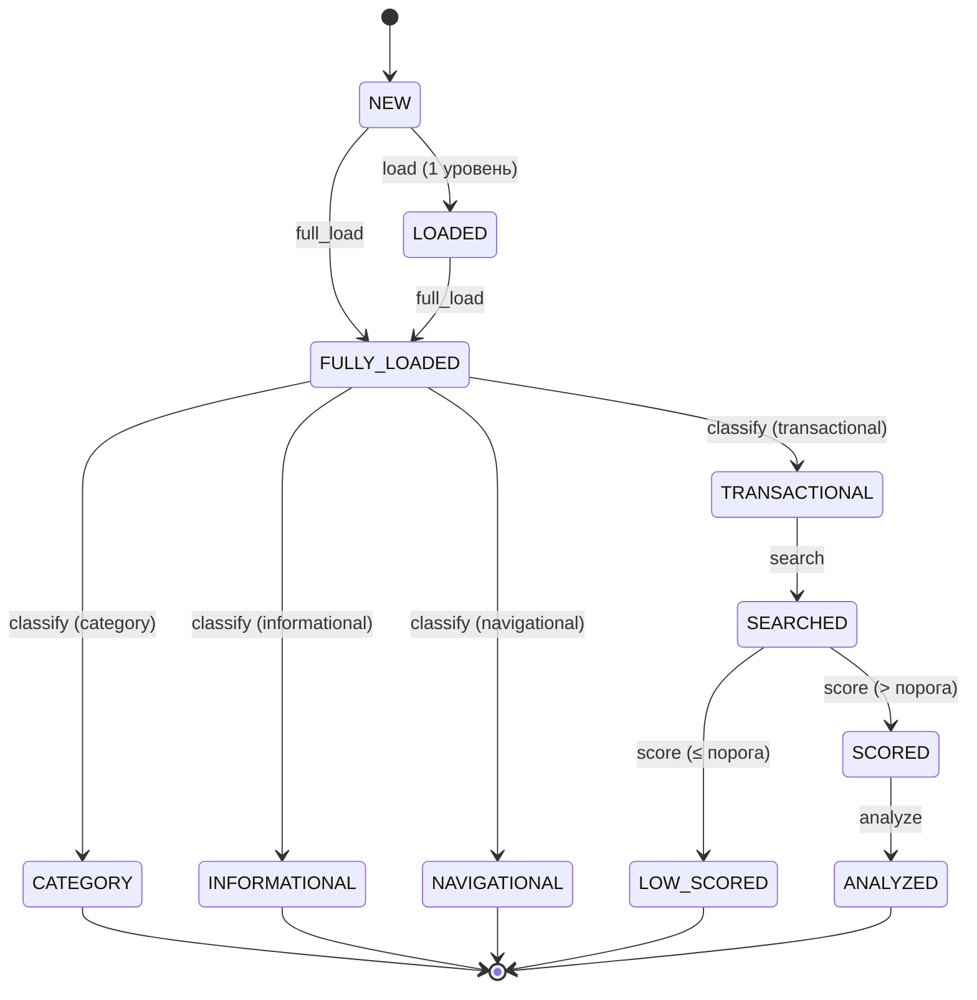

# Design: конвейер поиска ниш

Статус: дизайн (v4). Термины кода — на английском, пояснения — на русском. Алгоритмы —
прозой; из «кода» только SQL-схема и компактные JSON-контракты. Детальные промпты LLM — в
`task-worker-mcp/prompts/`, в спеке НЕ дублируются.

## 0. Зачем

Дерево запросов Вордстата (стадии 1–2) — слой **данных**. Нужен слой **выводов**: пройти
узлы, определить интент каждого (по Бродеру: **transactional** / informational / navigational)
и отсеять категории; по `transactional` оценить конкуренцию в выдаче и найти те,
где **есть спрос, но нет продукта**.

Принципы:
- Ценность ниши = **спрос ÷ конкуренция × лёгкость реализации**. Частота — приоритет, не
  фильтр ценности.
- **Интент (Бродер) + категория:** узел — либо **`category`** (зонтик, интент ещё НЕ определён:
  дети вводят РАЗНЫЕ интенты, либо запрос слишком широкий), либо один интент листа —
  **`transactional`** (хотят *сделать*, цель пайплайна), **`informational`** (хотят *узнать*),
  **`navigational`** (ищут конкретный бренд/продукт). Дальше идёт только `transactional`;
  `informational`/`navigational` паркуем на будущее.
- Реальную конкуренцию знает **только выдача** — её не угадываем, а проверяем.
- **Никаких штатных ошибок и транзакций.** Каждый статус — согласованное состояние (в нём
  узел мог бы оказаться и при ручных действиях). Операция либо переводит узел в следующий
  статус, либо падает → **ошибка в лог, узел остаётся как был**. Ни отмены, ни пауз.
- **Ретрай — только там, где источник сам просит повторить.** XMLRiver отвечает
  `code=500 «Выполните перезапрос»` — это его собственная пометка «отказ транзиентный», и такой
  запрос повторяется (10 c, 30 c, 60 c). Всё остальное — ошибка в лог без повтора: неверные
  параметры повторять бессмысленно, а падение шага не должно маскироваться.
  **Отказ источника нельзя ни кэшировать, ни принимать за пустой результат** — иначе он
  застывает в данных как факт «уточнений нет». (Прецедент: 97 таких ответов осели в кэше, 12%
  записей, и 97 узлов навсегда стали листьями.)

## 1. `drill` — операция-оркестратор

`drill` — **и самостоятельная операция** (кнопка/эндпоинт), **и оркестратор**: сцепляет
остальные операции по порядку и гонит узел и всё его поддерево к терминалу, обрабатывая
**каждого** кандидата (без бюджетов и остановок).

Шаги (каждый доступен и как отдельная операция, §2):
1. **`full_load`** — рекурсивно грузит узел и все подузлы (§4) → `FULLY_LOADED`.
2. **`classify`** — размечает поддерево по интенту: `transactional` → `TRANSACTIONAL`;
   `category`/`informational`/`navigational` → одноимённые терминалы.
3. По каждому **`TRANSACTIONAL`**: **`search`** → `SEARCHED`, **`score`** → `SCORED` (`score > порога`)
   либо `LOW_SCORED` (`≤`), и для `SCORED` — **`analyze`** → `ANALYZED`.

`drill` — **не транзакция**: выполняется до куда смог; упавший шаг → ошибка в лог, узел
остаётся в текущем (согласованном) статусе, остальное поддерево продолжает. Резюмируем
(повторный `drill` продолжает с текущего статуса). Перед запуском фронт показывает
подтверждение с оценкой объёма (§8).

**5 чистых терминалов:** `CATEGORY` (зонтик, интент не определён) · `INFORMATIONAL` ·
`NAVIGATIONAL` (интент не наш — паркуем на будущее) · `LOW_SCORED` (`score ≤ порога`) ·
`ANALYZED` (перспективно, разобрано). Исход читается по статусу — без `WHERE score > N`.

## 2. Конечный автомат узла (FSM)

`status` = последняя завершённая операция. «Идёт операция» — поле `task_id` (пока стоит,
кнопки этого узла и затронутого поддерева заблокированы; см. §8). Ошибка — поле `error`
(в лог; статус НЕ меняется).

### Статусы

| Статус | Смысл | Терминал? |
|---|---|---|
| `NEW` | не загружен (фронтир). Дефолт | нет |
| `LOADED` | загружен ЧАСТИЧНО — собственный пул, 1 уровень (браузинг) | нет |
| `FULLY_LOADED` | загружен ПОЛНОСТЬЮ — узел и все сабузлы (≥FLOOR). ГЕЙТ | нет |
| `TRANSACTIONAL` | classify: работа-действие (`kind=transactional`) — цель пайплайна | нет |
| `CATEGORY` | classify: зонтик, интент не определён (`kind=category`). **ТЕРМИНАЛ** | **да** |
| `INFORMATIONAL` | classify: хотят *узнать* (`kind=informational`) — паркуем. **ТЕРМИНАЛ** | **да** |
| `NAVIGATIONAL` | classify: конкретный бренд/продукт (`kind=navigational`) — паркуем. **ТЕРМИНАЛ** | **да** |
| `SEARCHED` | по `transactional`-узлу загружена выдача Яндекс+Google | нет |
| `SCORED` | Haiku-скор **> порога** (перспективно) — готов к анализу | нет |
| `LOW_SCORED` | Haiku-скор **≤ порога** — не перспективно. **ТЕРМИНАЛ** | **да** |
| `ANALYZED` | Opus-разбор (worth-building + затраты). **ТЕРМИНАЛ** | **да** |

Голова `freq>30000` → classify всегда ставит `CATEGORY` (интент размыт). Узлы `freq<FLOOR`
не бурятся вглубь, но остаются валидными листами со своим интентом.

### Диаграмма


### Переходы (from → операция → to)
| From | Операция | To |
|---|---|---|
| `NEW` | load (1 уровень) | `LOADED` |
| `NEW` / `LOADED` | `full_load` | `FULLY_LOADED` |
| `FULLY_LOADED` | `classify` → `transactional` | `TRANSACTIONAL` |
| `FULLY_LOADED` | `classify` → `category` / `freq>30000` | `CATEGORY` (терминал) |
| `FULLY_LOADED` | `classify` → `informational` | `INFORMATIONAL` (терминал) |
| `FULLY_LOADED` | `classify` → `navigational` | `NAVIGATIONAL` (терминал) |
| `TRANSACTIONAL` | `search` | `SEARCHED` |
| `SEARCHED` | `score` → `> порога` | `SCORED` |
| `SEARCHED` | `score` → `≤ порога` | `LOW_SCORED` (терминал) |
| `SCORED` | `analyze` | `ANALYZED` (терминал) |
| intent-терминал (`CATEGORY`/`INFORMATIONAL`/`NAVIGATIONAL`) ⇄ `TRANSACTIONAL` | `Fix kind` (оверрайд) | смена метки |

Пайплайн односторонний, кнопок «Re-» нет. Любой шаг при падении → ошибка в лог, статус не
меняется (повторить = запустить операцию снова, она идемпотентна по данным).

**`score` не удалось посчитать.** Если оценить нечего (обе выдачи пусты — `prompts/score.md`
возвращает `score = null`), узел **остаётся `SEARCHED`**, в лог идёт ошибка. Отдельного терминала
нет: случай редкий, а такой узел разумнее переоценить позже, чем похоронить. Следствие: `drill`
на таком узле дальше не пойдёт и оставит его нетерминальным — это осознанно, по общему правилу
«упало → статус не меняется».

**Инвариант `FULLY_LOADED`.** Узел держит этот статус, только пока **всё его поддерево
загружено** (каждый потомок с `freq ≥ FLOOR` запрошен). Узлы могут стать незагруженными *позже* —
например когда выбрасывается испорченная запись кэша; тогда предки продолжают утверждать
«загружено полностью», хотя это уже ложь, и `full_load` по ним не запустить (операция разрешена
только из `NEW`/`LOADED`). Поэтому нарушители инварианта возвращаются в `LOADED`.
Потомки ниже `FLOOR` нарушением не считаются — вглубь них мы и не бурим (§4).

**Инвариант `kind` ↔ `status`.** Они не дублируют друг друга, у них разные роли: **`kind` — вечная
метка интента** (её ставит `classify`, правит `Fix kind`), **`status` — позиция в пайплайне**.
Для трёх припаркованных интентов они совпадают по смыслу (`kind='category'` ⇄ `CATEGORY`), для
`transactional` расходятся: `kind` остаётся `transactional`, а `status` уходит дальше по цепочке
(`SEARCHED` → `SCORED` → `ANALYZED`). Правило: **`Fix kind` меняет оба согласованно** —
промежуточного состояния «новый `kind`, старый статус» не бывает; при возврате в `transactional`
статус откатывается к `TRANSACTIONAL`, ранее собранные выдача/скор/отчёт не удаляются.

### Кнопки по статусу
Показываются ТОЛЬКО разрешённые. Во время идущей операции кнопки затронутых узлов
**заблокированы** (не Cancel — просто disabled; см. §8). Отмены и ретрая нет.

| Статус | Кнопки |
|---|---|
| `NEW` | `Load` (1 ур.) · `Full load` · **`Drill`** |
| `LOADED` | `Full load` · **`Drill`** |
| `FULLY_LOADED` | `Classify` · **`Drill`** |
| `TRANSACTIONAL` | `Search` · **`Drill`** · `Fix kind` |
| `SEARCHED` | `Score` · **`Drill`** |
| `SCORED` | `Analyze` · **`Drill`** · `Search view` |
| `CATEGORY` | `Fix kind` (если классифицировано ошибочно) |
| `INFORMATIONAL` | `Fix kind` (если ошибочно; иначе припарковано) |
| `NAVIGATIONAL` | `Fix kind` (если ошибочно; иначе припарковано) |
| `LOW_SCORED` | `Search view` |
| `ANALYZED` | **`Link`** (открывает готовый отчёт `reports/{id}.html` в новой вкладке) |

Терминалы (`CATEGORY`/`INFORMATIONAL`/`NAVIGATIONAL`/`LOW_SCORED`/`ANALYZED`) операций
пайплайна не имеют — только просмотр (и `Fix kind` на intent-терминалах для правки ошибочного
интента). `Drill` — на любом нетерминальном статусе, доводит до терминала.

**`Link`** — особая кнопка: показывается на узле, ТОЛЬКО если у него есть отчёт
(`report_link != null`), при ЛЮБОМ статусе; открывает `reports/{id}.html` в новой вкладке.
(Отчёт есть ровно у `ANALYZED`, но гейт по наличию отчёта надёжнее статуса — переживает
изменения метки.)

## 3. Модель данных

### `node` — колонки

Существующие (этап 1–2, wscore): `phrase PK, freq, queried, total_refinements, queried_at,
score, verdict, note`. `score`/`verdict` теперь заполняет пайплайн (перезаписывает); `note` —
**ручная** пометка пользователя, пайплайн её не трогает.

Добавляются к схеме (пайплайн ещё не работал — колонки просто заводятся, см. §10):

| Колонка | Тип | Назначение / пример |
|---|---|---|
| `status` | `TEXT NOT NULL DEFAULT 'NEW'` | состояние FSM (§2): `'FULLY_LOADED'`, `'TRANSACTIONAL'`, `'ANALYZED'`… |
| `kind` | `TEXT` | `'transactional'`\|`'informational'`\|`'navigational'`\|`'category'`\|`NULL` |
| `classify_conf` | `REAL` | уверенность LLM 0–1 |
| `classify_reason` | `TEXT` | `'дети — модификаторы (…онлайн/…бесплатно): один интент → transactional'` |
| `score_weights` | `TEXT` | JSON весов в момент оценки (провенанс): `{"yandex":0.6,"google":0.4}` |
| `competition_yandex` | `INTEGER` | 0–100, сырая конкуренция по Яндексу |
| `competition_google` | `INTEGER` | 0–100, сырая конкуренция по Google |
| `description` | `TEXT` | фраза Haiku про гэп: `'ищут убрать фон с видео на телефоне; в топе десктоп+статьи'` |
| `signals_json` | `TEXT` | JSON сигналов Haiku: `[{"code":"NO_DEDICATED_TOOL","weight":40,"evidence":"…"}]` |
| `verdict_score` | `REAL` | Opus 0–100 «стоит строить» (спрос ÷ конкуренция × лёгкость) |
| `error` | `TEXT` | текст последней ошибки: `'HTTP 500 от XMLRiver (Google)'` |
| `error_stage` | `TEXT` | стадия ошибки: `'search'` |
| `task_id` | `TEXT` | id текущей задачи (= `task.id`); пока не `NULL` — узел заблокирован |
| `classified_at` | `INTEGER` | unix-таймстемп classify |
| `searched_at` | `INTEGER` | unix-таймстемп search |
| `scored_at` | `INTEGER` | unix-таймстемп score |
| `analyzed_at` | `INTEGER` | unix-таймстемп analyze |

`score` (`REAL`, Haiku 0–100 итог) и `verdict` (`TEXT` `'BUILD'|'MAYBE'|'SKIP'`, бакет от
`verdict_score`) уже существуют — не добавляем, пайплайн их перезаписывает. Ссылки на отчёт в
`node` нет — отчёт узла ищется по `report.node = phrase` (см. таблицу `report`).

### `serp` — кэш выдачи
```sql
CREATE TABLE IF NOT EXISTS serp (
  phrase TEXT NOT NULL, engine TEXT NOT NULL,      -- 'yandex' | 'google'
  found INTEGER,                                   -- всего найдено (задел, в оценке пока не участвует)
  docs_json TEXT NOT NULL,                         -- [{rank,url,title,snippet}]
  fetched_at INTEGER NOT NULL, PRIMARY KEY (phrase, engine));
```

### `task` — журнал операций (для вкладки Task + трекинга)
```sql
CREATE TABLE IF NOT EXISTS task (
  id TEXT PRIMARY KEY, type TEXT NOT NULL,         -- full_load|classify|search|score|analyze
  status TEXT NOT NULL,                             -- QUEUED|RUNNING|DONE|FAILED
  node TEXT, params TEXT, result TEXT,
  created_at INTEGER, started_at INTEGER, finished_at INTEGER, error TEXT);
```
`node` = фраза (напр. `'нейросеть видео'`); `id` — уникальный идентификатор задачи; `error` напр.
`'таймаут ожидания результата LLM'`. `params`/`result` — JSON, напр.:
- `params` (classify): `{"root":"нейросеть видео","nodes":[{"phrase":"нейросеть видео из фото","freq":1200,"children":["…"]}]}`
- `result` (score): `{"results":[{"phrase":"…","score":85,"competition_yandex":20,"competition_google":30,"weights":{"yandex":0.6,"google":0.4}}]}`

### `report` — HTML-отчёты Opus (файл на диске, в БД только ссылка) + вкладка «Отчёты»
```sql
CREATE TABLE IF NOT EXISTS report (
  id TEXT PRIMARY KEY,                          -- = id analyze-задачи
  node TEXT NOT NULL REFERENCES node(phrase),   -- FK: join → title/verdict/verdict_score узла
  link TEXT NOT NULL,               -- относит. путь к файлу, напр. 'reports/b3f1a9c2.html'
  created_at INTEGER NOT NULL);
```
Отчёт большой → лежит **файлом** `reports/{id}.html` (отдаётся статикой), в БД — только `link`.
Отчёт узла находим по `report.node = phrase` (отдельного `node.report_id` не держим). Вкладка
«Отчёты» (§8) = `report JOIN node` → фраза-заголовок + вердикт + `verdict_score` + дата + ссылка.

## 4. `full_load` (recursive-load, краул)

Грузит поддерево ЦЕЛИКОМ до конца — гейт для пайплайна.
- **`LOADED`** — собственный пул на 1 уровень (браузинг). **`FULLY_LOADED`** — весь subtree
  (каждый потомок ≥FLOOR запрошен). Только `FULLY_LOADED` открывает `classify`.
- **Как работает:** многократно опрашиваем фронтир (переиспользуя `wscore.load_phrase`),
  best-first по частоте, пока фронтир не опустеет → всё поддерево `FULLY_LOADED`.
- **`FLOOR=50`** — граница РЕКУРСИИ: ниже не бурим вглубь (хвост почти нулевой), но узел+ребро
  пишем и он остаётся валидным листом. НЕ фильтр ценности.
- **DAG-дедуп:** ребёнок — строгое словесное супермножество родителя (циклов нет). Фраза с
  нескольких родителей фетчится один раз, ребро — от каждого.
- **Потолка (CAP) нет.** Штатных ошибок быть не должно; объём заранее показываем оценкой в
  диалоге подтверждения `Drill`/`Full load` (§8 «~N узлов / ~X запросов — Да/Нет»).
- Прогресс и апдейты статусов — **по websocket** (§8): узлы дерева обновляются в реальном
  времени, ход краула сыплется в лог.

**`LIMIT` и `WORKERS` — что это (обоснование):**
- **`LIMIT`** — сколько фраз из пула фразы оставляем детьми. Вордстат/XMLRiver отдаёт на
  запрос **не более ~2000** «популярных» фраз, поэтому `LIMIT=2000` = «взять весь пул».
  Это не произвольный тюнинг, а потолок самого источника; уменьшать имеет смысл лишь чтобы
  срезать ширину дерева.
- **`WORKERS≈6`** — сколько запросов к XMLRiver держим параллельно во время краула. Один
  фетч ~0.5–1 с и упирается в сеть (I/O-bound), поэтому 6 одновременных ускоряют краул в
  ~6× при вежливой нагрузке. Тредов достаточно (не CPU). Чисто оптимизация скорости.

## 5. Исполнение операций (асинхронные задачи)

Все операции — **асинхронные фоновые задачи**: не блокируют UI, трекинг — таблица `task` (§3).
Два класса по тому, кто делает работу:
- **Не-LLM** (`full_load`, `search`) — система выполняет сама (обращения к XMLRiver).
- **LLM** (`classify`, `score`, `analyze`) — система **сама модель не зовёт**, а делегирует
  работу внешнему **LLM-агенту** и ждёт результат.

**Решение уровня дизайна — какая «голова» делает какую работу.** LLM-агент получает задачи
пачкой, оркестрирует их параллельно и под **каждый тип берёт свою модель** (баланс цена/качество):
**`classify` → Sonnet**, **`score` → Haiku**, **`analyze` → Opus 1M xhigh**. *Как* агент
подключён и *как* задачи до него доходят/возвращаются — вопрос реализации (`tech-design.md` §3,
§7), в дизайне не фиксируем.

Промпты классификации/скоринга/анализа — в **`task-worker-mcp/prompts/{classify,score,
analyze}.md`**; в спеке не дублируем.

## 6. Типы задач
Пишут в `node`/`serp`. Модель — источник истины.

### 6.1 `classify` (Sonnet, один проход по поддереву)
Размечает `kind=transactional|informational|navigational|category` (интент по Бродеру). Промпт: `prompts/classify.md`.
- **params:** `{root, nodes:[{phrase, freq, children:[phrase,…]}]}` (дети `<FLOOR` не шлём).
- **пишет:** `node.kind, classify_conf, classify_reason`; `FULLY_LOADED → TRANSACTIONAL|CATEGORY|INFORMATIONAL|NAVIGATIONAL`.

### 6.2 `search` (XMLRiver, без LLM)
Яндекс `GET /search_yandex/xml` + Google `GET /search/xml`, топ-10. При падении движка —
**ошибка в лог, узел остаётся `TRANSACTIONAL`** (частичной выдачи нет — либо оба, либо ошибка).
- **params:** `{phrase, engines:["yandex","google"], top:10, region:"ru"}`.
- **пишет:** `serp`; `TRANSACTIONAL → SEARCHED`.

### 6.3 `score` (Haiku, батч)
Оценка 0–100 «работа есть, но выдача её не закрывает». Промпт+рубрика: `prompts/score.md`.
**Порог = 60:** `score > 60` → `SCORED`, `≤ 60` → `LOW_SCORED`.
- **params:** `{items:[{phrase, freq, serps:{yandex,google}}]}`.
- **пишет:** `node.score` (итог), **два сырых входа `competition_yandex/google`**,
  `score_weights`, `description, signals_json`; `SEARCHED → SCORED|LOW_SCORED`.
- **логирует** по каждой фразе сырые входы (`competition_yandex/google`, веса) и итог (`score`)
  — одной строкой (§9); их достаточно, чтобы перекалибровать веса/гейты позже без прогона LLM.

### 6.4 `analyze` (Opus 1M xhigh, один узел)
Стоит ли делать + оценка затрат. Промпт: `prompts/analyze.md`.
- **params:** `{phrase, freq, score, description, serps}`.
- **пишет:** `node.verdict` (`'BUILD'|'MAYBE'|'SKIP'`), `verdict_score` (0–100); **HTML-отчёт**
  → файл `reports/{id}.html` + строка `report(id, node, link)`; `SCORED → ANALYZED`. Opus рендерит
  HTML по шаблону `task-worker-mcp/templates/report.html`. (`note` не трогаем — ручное.)

## 7. API-поверхность (CQRS)

**Read model — WebSocket** (единый канал `/ws`): клиент подписывается, сервер шлёт в
реальном времени: снимок/апдейты дерева (статусы, новые дети, скоры), логи, апдейты задач,
новые отчёты. Всё чтение дерева/логов/задач/отчётов — только отсюда (в т.ч. первичная загрузка
и `expand`-проекция).

**Write model — HTTP POST, `phrase` в body** (единообразно, без phrase в пути):
- `POST /api/node/load` `{phrase}` — браузинг 1 уровень.
- `POST /api/node/full-load` `{phrase}` — краул поддерева.
- `POST /api/node/op` `{phrase, op: classify|search|score|analyze}` — один шаг.
- `POST /api/node/drill` `{phrase}` — оркестратор (§1). Анализируются все `SCORED`: отдельной
  ручки-порога нет, планку задаёт порог `score`.
- `POST /api/node/kind` `{phrase, kind}` — ручной оверрайд `Fix kind`.

Команды запускают фоновую задачу (узел получает `task_id`, кнопки блокируются) и сразу
возвращают ack; прогресс/результат прилетают по websocket.

## 8. Требования к UI

*(Единое место для всех UI-требований.)*

- **Четыре вкладки:**
  1. **Главная** — дерево запросов (текущее приложение).
  2. **Лог** — окно логов. Детали — **§9 «Требования к логам»**.
  3. **Task** — таблица задач (`task` §3): тип, узел, статус, время, ошибка.
  4. **Отчёты** — список готовых отчётов (`report JOIN node`): фраза-заголовок узла, вердикт,
     `verdict_score`, дата, ссылка (открыть в новой вкладке). Сортировка по `verdict_score`.
- **`Drill` / `Full load`** — перед запуском **диалог подтверждения** «Вы уверены? Загрузит
  не менее ~N узлов / ~X запросов, может оказаться больше» (Да/Нет). Оценка считается по уже
  загруженному поддереву, поэтому для незагруженного узла близка к нулю — это **предупреждение об
  объёме, а не обещание числа**. Потолков нет.
- **Real-time:** статусы узлов и логи обновляются по websocket по мере выполнения (без
  перезагрузки/поллинга на фронте).
- **Блокировка на время операции:** пока по узлу идёт задача (`task_id`), заблокированы
  кнопки **только затронутого узла и его поддерева**, а не всего дерева. Отмены нет —
  дожидаемся завершения; ошибка уходит в лог, узел остаётся как был.
- **Терминалы:** `CATEGORY`/`LOW_SCORED` — без действий пайплайна; `ANALYZED` — **одна
  кнопка `Link`** (видна только при наличии отчёта), открывает **готовый HTML-отчёт**
  (`report.link` по `report.node=phrase`,
  напр. `/reports/{id}.html`) **на всю страницу в НОВОЙ вкладке**. Рендерить на фронте не нужно —
  HTML уже собран Opus. `Search view` — просмотр сохранённой выдачи.
- Цветные `+` в дереве (зелёный — локальные из пула, синий `⚡` — реальные/загруженные)
  сохраняются как сейчас.

## 9. Требования к логам

*(Единое место для всех требований по логам — раньше были размазаны по §0/§2/§8.)*

- **Отдельная вкладка «Лог».** *(Была идея держать логи панелью снизу с ресайзом — отказались
  в пользу отдельной вкладки.)*
- **Что логируется:** ход операций (`full_load`-краул, `search`, `classify`/`score`/`analyze`),
  переходы статусов узлов и **все ошибки операций** (упавший шаг → строка-ошибка; статус узла
  при этом НЕ меняется, см. §0/§2). Никаких «немых» падений — всё видно в логе.
- **Real-time.** Поток идёт по websocket (событие `log`, §7), без поллинга на фронте.
- **Дублирование в файл.** Каждая лог-строка пишется ещё и в файл — чтобы LLM/разработчик
  **смотрел логи сам** (читал файл напрямую), а не просил пользователя их скинуть. Файл —
  источник авто-диагностики; пишется всегда, даже если ни одна вкладка не открыта.
- **Кнопка «Удалить всё»** (на вкладке Лог) — очищает и представление в UI, **и файл**
  (truncate). После неё пусто везде.
- **Формат строки одинаков** в UI и файле: `время · уровень · стадия · узел · сообщение`.
- При открытии вкладки показываем недавнюю историю (хвост файла), дальше — живой стрим.

Механика (файл, эндпоинт очистки) — в `tech-design.md §6`.

## 10. Порядок реализации (фазы)
1. Схема: новые колонки `node` (§3) и таблицы `serp`,`task`,`report`. Пайплайн ещё не
   работал, поэтому `node`/`edge` пересобираются из `cache` — миграция не нужна. **`cache` и
   `keywords` не трогаем.** После первого прогона пайплайна схему менять только аддитивно.
2. WebSocket read-канал (`/ws`): снимок дерева + апдейты + логи. Перевести чтение дерева на него.
3. `full_load` как фоновая задача + `POST /api/node/full-load`; прогресс/статусы по websocket.
4. `search` (Яндекс+Google) как фоновая задача (не-LLM).
5. Делегирование LLM-задач внешнему агенту (§5): очередь задач + возврат результата, промпты в файлах.
6. `classify` (Sonnet), `score` (Haiku, порог 60) через LLM-агента; промпты в файлах.
7. `analyze` (Opus 1M xhigh) + отчёт на всю страницу (новая вкладка).
8. Оркестратор `drill` + диалог подтверждения.
9. UI: 4 вкладки (вкл. «Отчёты»), кнопки по FSM (§2, §8), блокировки, отчёт.
